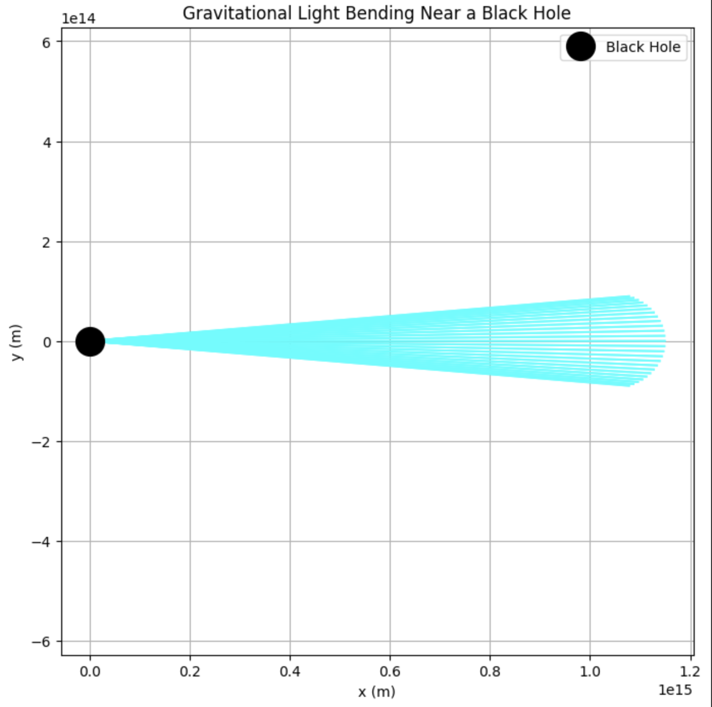

# Gravitational Light Bending Simulation

This project simulates the bending of light rays near a supermassive black hole using Newtonian gravity-based approximations. It demonstrates how stronger gravitational fields can curve the path of light, creating a lensing-like effect.

---

## 🧠 Concept

In general relativity, gravity curves spacetime. This simulation approximates that behavior by numerically integrating how photons (moving at constant speed) get deflected near a massive object. It’s a simplified visual representation of gravitational lensing.

---

## 📊 Output

- Straight rays far from the black hole
- Strongly bent rays near the center
- A lens-like visual pattern emerges

---

## 🛠 Tools & Methods

- Python (NumPy, Matplotlib)
- Euler integration for motion equations
- Adjustable parameters (mass, ray spacing, speed)
- Jupyter Notebook / Google Colab

---

## 📁 Files

- `bending_simulation.ipynb`: Full simulation code
- `bending_output.png`: Sample output image
- `README.md`: This file

---

## 🚀 What I Learned

- How to apply force-based models to light rays
- Simulating curved paths using Newtonian approximations
- Visualizing abstract relativity concepts numerically

---

## 🔭 Future Improvements

- Simulate relativistic geodesics (beyond Newtonian)
- Add background stars for realism
- Color-code rays by deflection strength

---
